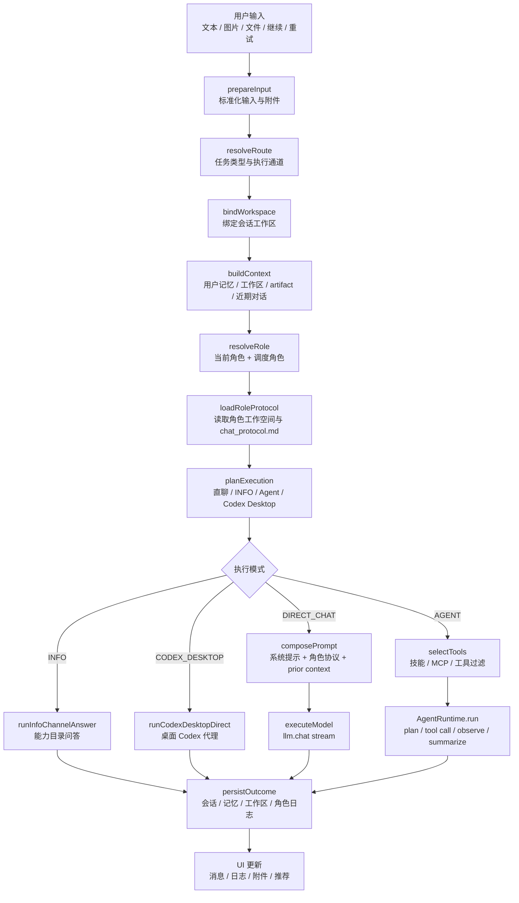
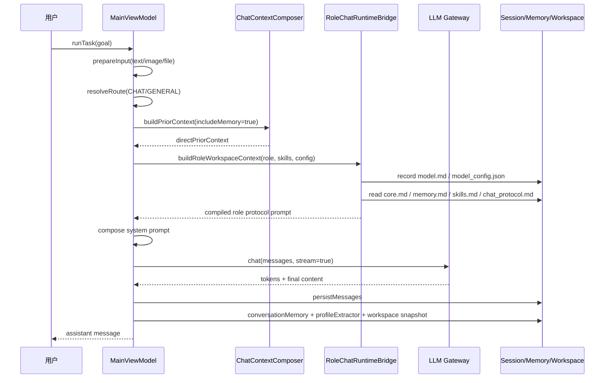
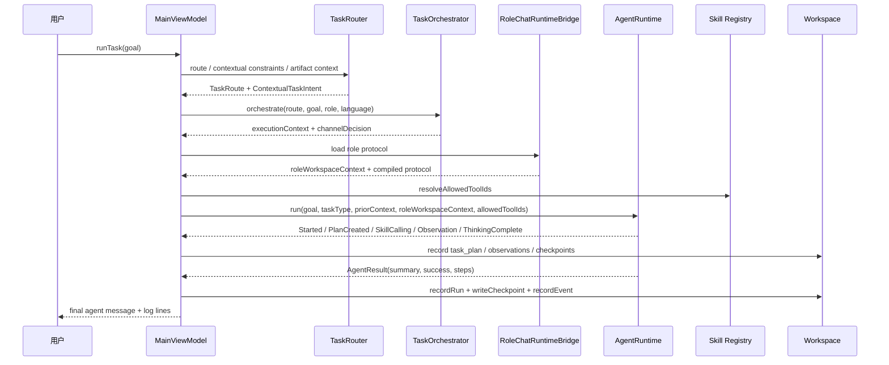
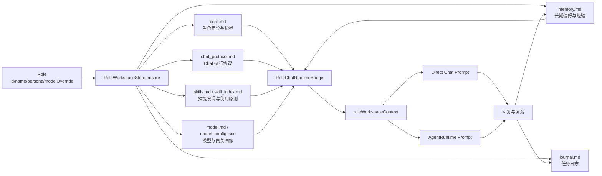
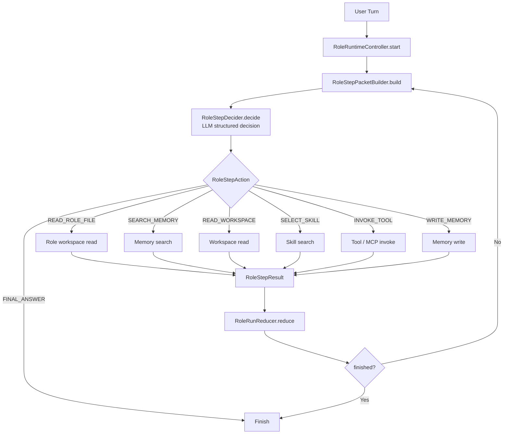
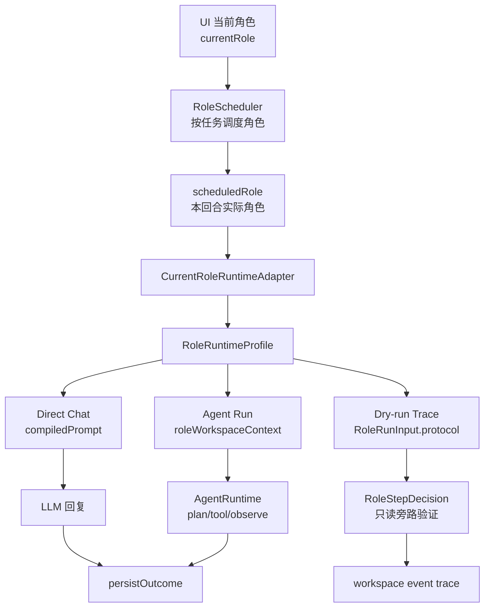
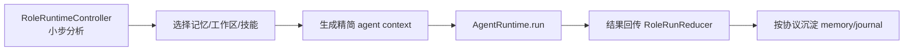
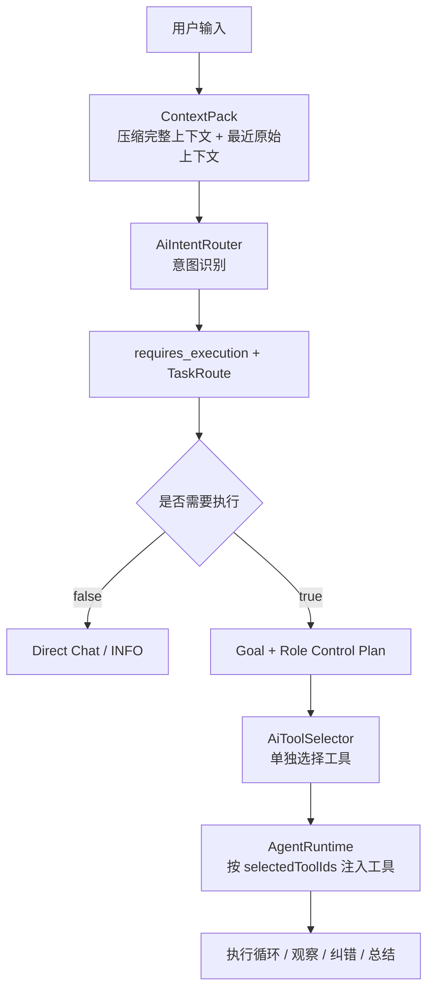

# 角色驱动 Chat Runtime 架构与实现计划

## 1. 背景

MobileClaw 现在的 Chat 能完成聊天、工具执行、工作空间记录、角色调度等能力，但主流程集中在 `MainViewModel.runTaskInternal`：

- 附件处理、路由、上下文构建、角色调度、模型执行、工具循环、记忆写入都在同一条流程里串接。
- `ChatContextComposer` 负责拼接 prior context，但它还不是完整的 Chat 执行协议。
- 角色已经有 `core.md`、`skills.md`、`memory.md`、`model.md` 等工作空间文件，但角色对 Chat 工作方式的影响仍偏 prompt 注入。

用户真正需要的是：角色不是换一种说话方式，而是换一套 AI 工作方式。角色应该能定义“如何理解输入、如何读取上下文、何时调用技能、何时写记忆、如何回复、如何沉淀结果”。

因此第一步不是先做复杂 UI，也不是先写一个角色 prompt，而是先把 Chat 执行流程方法化，再让角色协议去编排这些方法。

## 2. 目标

### 2.1 产品目标

- 角色成为 MobileClaw 工作空间和 Chat 执行方式的核心组织者。
- 每个角色有独立工作空间，包含身份、技能、记忆、模型配置、执行协议等文件。
- 用户切换角色时，实际切换的是 Chat Runtime 的工作协议，而不仅是头像、气泡和语气。

### 2.2 工程目标

- 将 Chat 执行拆成稳定阶段，每个阶段有明确输入、输出和可插拔策略。
- 定义 `RoleExecutionProtocol`，让角色能声明各阶段行为。
- 在不重写整个 `runTaskInternal` 的前提下，先把协议文件接入现有上下文。
- 后续逐步将 `MainViewModel` 中的流程迁移到 `ChatRuntime`。

## 3. Chat Runtime 方法化

Chat Runtime 应拆为以下阶段：

| 阶段 | 方法 | 责任 | 当前对应位置 |
| --- | --- | --- | --- |
| 1 | `prepareInput` | 处理文本、图片、文件附件，形成可执行输入 | `runTaskInternal` 附件处理 |
| 2 | `resolveRoute` | 判断任务类型、执行通道、上下文意图 | `TaskRouter` / routeOverride |
| 3 | `bindWorkspace` | 绑定会话工作区，写入开始事件 | `WorkspaceRuntimeCoordinator` |
| 4 | `buildContext` | 读取用户记忆、工作空间、artifact、近期对话 | `ChatContextComposer` |
| 5 | `resolveRole` | 根据当前角色、任务、记忆上下文选择执行角色 | `RoleScheduler` |
| 6 | `loadRoleProtocol` | 读取角色目录下的执行协议和模型配置 | `RoleWorkspaceStore` |
| 7 | `planExecution` | 根据 route、角色协议、附件和模型能力决定直聊或 agent | `TaskOrchestrator` + fast path |
| 8 | `composePrompt` | 拼接系统提示、角色协议、上下文和用户输入 | direct chat / agent prompt |
| 9 | `selectTools` | 根据任务和角色协议过滤技能、MCP、工具 | `resolveAllowedToolIds` / registry |
| 10 | `executeModel` | 执行模型请求或 agent loop | `llm.chat` / `AgentRuntime.run` |
| 11 | `handleEvents` | 把 token、工具调用、观察结果同步到 UI 和工作区 | event collectors |
| 12 | `persistOutcome` | 写会话、记忆、角色日志、workspace checkpoint | completion blocks |

这些阶段不是必须每次都完整执行。例如普通聊天可能只走 `prepareInput -> resolveRoute -> buildContext -> resolveRole -> loadRoleProtocol -> composePrompt -> executeModel -> persistOutcome`。

## 3.1 总体流程架构图



## 3.2 Direct Chat 细节图



## 3.3 Agent 执行细节图



## 3.4 角色工作空间参与 Chat 的数据流



## 3.4.1 当前角色适配层

Chat 中“当前使用的角色”不能只等于 UI 选中的 `Role` 对象。真正进入执行前，需要把角色适配成一份运行画像：

- `Role`：当前回合最终使用的角色，可能来自 UI 当前角色，也可能来自 `RoleScheduler` 调度结果。
- `RoleWorkspaceSnapshot`：角色目录中的 `core.md`、`memory.md`、`skills.md`、`model.md`、`chat_protocol.md`。
- `RoleExecutionProtocol`：从 `chat_protocol.md` 解析出的结构化执行协议。
- `SkillMeta` 列表：角色可按需发现的全量技能索引。
- `compiledPrompt`：供 Direct Chat 和 Agent Runtime 注入的紧凑角色上下文。

第一版实现为：

- `CurrentRoleRuntimeAdapter.adapt(...)`
- `RoleRuntimeProfile`
- `RoleChatRuntimeBridge.adaptCurrentRole(...)`

现阶段 Direct Chat、Agent Run、dry-run trace 都应从这个适配入口读取角色协议和工作空间，避免每条路径各自读取或解析角色文件。

## 3.5 当前 MainViewModel 中的真实细节映射

下面是现有 `runTaskInternal` 中已经存在的事实流程，后续拆分时应保持行为等价。

### 输入准备

- 读取当前会话 id。
- 判断当前是否已有任务运行。
- 处理 Codex Desktop 模式。
- 合并 `imageOverride`、pending turn 图片、输入框图片。
- 处理文件附件：
  - 文本文件直接拼入 `effectiveGoal`。
  - 图片保存到本地工作区，并把路径写进 goal。
- 构造 `ChatMessage`。
- 提前持久化用户消息，避免任务取消后丢失。

### 路由与工作区

- 如果 Codex Desktop 模式直接走桌面代理。
- 否则生成或使用 `TaskRoute`：
  - `taskType`
  - `ContextualTaskIntent`
  - `goalForExecution`
  - `goalToRemember`
  - `debugReason`
- 绑定 workspace session。
- 对工作区恢复信息做 goal augmentation。
- 对 artifact / AI page / MiniAPP 做 contextual constraints。

### 上下文构建

- `directPriorContext`：包含用户记忆、工作区、artifact，不含近期聊天。
- `agentPriorContext`：通常不含长期记忆，避免 agent prompt 过重。
- `schedulingContext`：包含用户记忆和近期聊天，用于角色调度。
- `ChatContextComposer` 当前读取：
  - user memory
  - workspace context
  - artifact context
  - recent chat context

### 角色解析

- 当前角色来自 UI 状态。
- `RoleScheduler.schedule()` 用任务类型、目标、可用角色、当前角色、记忆上下文做调度。
- `shouldUseScheduledRoleForRun()` 决定是否真的切换到调度角色。
- 角色工作空间上下文由 `RoleChatRuntimeBridge` 加载：
  - 写入最近模型配置。
  - 读取角色文件。
  - 解析 `chat_protocol.md`。
  - 输出结构化协议摘要。

### 执行规划

- `TaskOrchestrator.orchestrate()` 生成执行上下文和通道决策。
- `resolveAllowedToolIds()` 根据 route、tool hints、goal 过滤工具。
- 分支：
  - INFO：能力目录问答。
  - 图片理解 fast path：直聊。
  - 普通对话 fast path：直聊。
  - 其他：AgentRuntime。

### Direct Chat

## 3.6 角色多步执行循环

为了避免把角色定义、记忆、工作空间和所有工具一次性塞进云端模型，角色执行应支持“一个用户回合内多步、小上下文”的循环。

核心思想：

- App 本地持有 `RoleRunState`，负责真实状态推进。
- 每一步只构建一个小的 `RoleStepPacket` 给模型。
- 模型只返回结构化 `RoleStepDecision`，例如读取记忆、读取角色文件、选择技能、调用工具、写记忆或最终回复。
- App 根据 decision 执行真实动作，得到 `RoleStepResult`。
- `RoleRunReducer` 把结果归约回 `RoleRunState`，再进入下一步。



第一版契约已经落在：

- `RoleRunInput`：一次用户回合的角色运行输入。
- `RoleRunState`：多步执行状态。
- `RoleStepPacket`：每一步给模型的小上下文包。
- `RoleStepDecision`：模型返回的结构化下一步。
- `RoleStepResult`：App 执行动作后的结果。
- `DefaultRoleRuntimeController`：默认单步推进控制器。
- `DefaultRoleStepPacketBuilder`：默认步骤上下文构建器。
- `DefaultRoleRunReducer`：默认状态归约器。
- `LlmRoleStepDecider`：把 `RoleStepPacket` 交给模型，要求模型返回结构化下一步 JSON，并在解析失败时安全降级。
- `DelegatingRoleStepExecutor`：把不同 `RoleStepAction` 分发到可注入 handler，避免未接线的 memory/workspace/tool 动作静默执行。
- `RoleStepReadOnlyHandlers`：提供第一批安全只读 handler，支持读取角色文件、检索语义记忆、读取 workspace 摘要/文件、按需选择候选技能。
- `RoleRuntimeFactory.createReadOnlyController()`：组装 LLM decider、只读 handlers、delegating executor 和默认 reducer。
- `MainViewModel.createReadOnlyRoleRuntimeController()`：在真实 app 依赖下验证 controller 组装路径，但暂不接入现有 chat 行为。

### 用户可见性规则

多步执行不能全黑盒，也不能把每个内部步骤都刷给用户。`RoleStepVisibility` 把步骤分成四档：

| Visibility | 是否展示 | 用途 |
| --- | --- | --- |
| `SILENT` | 不展示给用户，只写 trace | token 裁剪、内部协议整理、无价值中间态 |
| `TRACE` | 默认折叠到调试/过程详情 | 读取角色文件、检索记忆、筛选技能等轻量上下文动作 |
| `USER_TIMELINE` | 展示在聊天执行时间线 | 读取工作空间、调用工具、写入记忆、产生关键阶段结果 |
| `CONFIRMATION` | 展示为需要用户参与的卡片 | 权限、危险操作、不可逆写入、需要用户选择 |

展示给用户的内容不是原始 prompt、完整记忆或完整 md，而是 `RoleStep.userSummary`：

- “已读取角色文件：memory.md”
- “找到 3 条相关长期记忆”
- “已读取工作空间上下文：summary”
- “筛选出 5 个候选技能”
- “准备调用文件写入工具”

更详细的 `inputSummary`、`outputSummary`、`content` 只进入 trace / debug / workspace event，不直接铺到聊天主界面。

### Dry-run Trace 接入

第一版 dry-run trace 已接入 agent run 旁路：

- 开关：`UserConfig["role_runtime_dry_run_trace_enabled"] == "true"`，默认关闭，避免无意增加模型调用成本。
- 步数：`ROLE_RUNTIME_DRY_RUN_MAX_STEPS`，默认 `2`。
- 入口：`MainViewModel.maybeStartRoleRuntimeDryRunTrace()`。
- 运行方式：agent prelude 完成、拿到 resolved session 后，旁路启动 read-only role runtime。
- 结果写入：每个 step 记录到 workspace event，category 为 `role_runtime_dry_run`。
- 用户展示：只有 `USER_TIMELINE` / `CONFIRMATION` 级别的 step 会追加到 active log；`TRACE` 只进 workspace event。
- 业务影响：dry-run 不改变 `AgentRuntime.run()` 的 goal、工具、上下文和最终回复。

这套循环不会替代现有 `AgentRuntime.run()`，而是先作为更上层的角色控制协议存在。后续可以选择：

- direct chat：只跑 1 到 2 个 step，通常是 `ANALYZE_INTENT -> FINAL_ANSWER`。
- agent run：先跑角色 step 选择记忆、工作区和工具，再进入 `AgentRuntime.run()`。

- 绑定工作区并记录 `direct_chat_started`。
- 更新会话角色。
- 拼接语言约束。
- 拼接角色人格。
- 拼接角色工作空间和协议。
- 拼接 prior context。
- 按本地模型模式压缩 prompt。
- `buildStructuredDirectChatMessages()` 生成 system + history + current user。
- `llm.chat()` stream token。
- 完成后记录：
  - `direct_chat_completed`
  - session messages
  - conversation memory
  - profile extraction
  - workspace task snapshot

### Agent Runtime

- 创建 `AgentRuntime(llm, registry, semanticMemory, memoryContextBuilder)`。
- 显示 overlay。
- 记录 task plan 到 workspace。
- 收集 runtime events：
  - `Started`
  - `ThinkingToken`
  - `PlanCreated`
  - `SkillCalling`
  - `Observation`
  - `ThinkingComplete`
  - `Warning`
  - `Error`
- 调用 `rt.run()`，传入：
  - contextual goal
  - task type
  - prior context
  - episodic context
  - execution context
  - role
  - user profile context
  - allowed tool ids
  - role workspace context
- 完成后记录：
  - episodic memory
  - task replay / recipe
  - workspace run / checkpoint / event
  - conversation memory
  - profile extraction
  - role home 装饰

### 结果持久化

- UI 追加最终 agent message。
- 持久化用户消息和 agent 消息。
- 刷新推荐。
- 如 MiniAPP preview 发现问题，触发自动修复续跑。

## 3.6 第一版 Runtime Ports

代码中已经新增 `ChatRuntimePorts.kt`，将上述细节暴露为后续可实现接口：

| Port | 作用 |
| --- | --- |
| `ChatInputPreparer` | 输入和附件标准化 |
| `ChatRouteResolver` | 生成 `TaskRoute` |
| `ChatWorkspaceBinder` | 绑定工作区 |
| `ChatContextBuilder` | 构建 prior context bundle |
| `ChatRoleResolver` | 当前角色和调度角色决策 |
| `ChatRoleProtocolLoader` | 加载角色协议 |
| `ChatExecutionPlanner` | 决定 direct/info/agent/codex desktop |
| `ChatPromptComposer` | 组装 direct chat prompt |
| `ChatToolSelector` | 过滤工具和技能 |
| `ChatModelExecutor` | 执行模型或 agent |
| `ChatOutcomePersister` | 写会话、记忆、工作区和角色日志 |

这些接口暂时不强行替换现有流程，因为 `runTaskInternal` 仍承载大量 UI 状态和历史行为。正确迁移方式是逐个 port 用现有逻辑实现，保持行为等价后再移动调用点。

## 4. RoleExecutionProtocol

角色协议是角色工作空间中的 `chat_protocol.md`，它不是单纯 system prompt，而是角色对 Chat Runtime 阶段的配置。

建议结构：

```markdown
# Chat Execution Protocol

## Runtime Contract
- Role id: creator
- Protocol version: 1

## Input Understanding
- 先判断用户是闲聊、追问、修改当前 artifact，还是要求执行动作。

## Context Reading
- 读取 core.md 获取角色定位。
- 读取 memory.md 获取长期偏好。
- 读取 model.md 获取模型偏好。
- 按需查看 skill_index.md。

## Memory Policy
- 只有稳定偏好、重要事件、可复用经验写入 memory.md。
- 一次性闲聊不写长期记忆。

## Skill Policy
- 所有技能都可发现，但必须按任务需要选择。
- 不确定时先读取技能说明。

## Response Policy
- 普通问答直接回答。
- 执行类任务说明结果、关键产物和下一步。

## Persistence Policy
- 重要任务完成后追加 journal.md。
- 学到角色工作习惯时更新 memory.md。
```

运行时读取协议后，应转换成结构化对象：

```kotlin
data class RoleExecutionProtocol(
    val roleId: String,
    val version: Int,
    val inputUnderstanding: String,
    val contextReading: String,
    val memoryPolicy: String,
    val skillPolicy: String,
    val responsePolicy: String,
    val persistencePolicy: String,
)
```

## 5. ChatExecutionContext

Chat Runtime 每一轮应维护一个执行上下文，作为阶段之间传递信息的黑板：

```kotlin
data class ChatExecutionContext(
    val sessionId: String,
    val userGoal: String,
    val effectiveGoal: String,
    val taskType: TaskType,
    val route: TaskRoute?,
    val role: Role,
    val roleProtocol: RoleExecutionProtocol?,
    val priorContext: String,
    val workspaceId: String?,
    val allowedToolIds: Set<String>,
)
```

第一版可以先定义结构，不要求马上把 `runTaskInternal` 全量迁移。

## 6. 角色如何编排 Chat

角色协议不直接调用 Kotlin 方法，而是通过阶段策略影响 Chat Runtime：

- `Input Understanding` 影响 `resolveRoute` 和 `planExecution`：例如创意角色更敏感于“继续、改一下、生成文档”等 artifact follow-up。
- `Context Reading` 影响 `buildContext`：决定读取哪些角色文件、近期对话和工作区文件。
- `Memory Policy` 影响 `persistOutcome`：决定什么写入长期记忆，什么只写入 journal。
- `Skill Policy` 影响 `selectTools`：决定优先发现哪些技能，是否允许 MCP/公开工具。
- `Response Policy` 影响 `composePrompt` 和 `composeReply`：决定回答结构、是否展示产物、是否给下一步。
- `Persistence Policy` 影响工作空间沉淀：决定更新 `memory.md`、`journal.md`、`skills.md` 等。

## 6.1 角色控制 Chat 的本质

角色控制 Chat 不是让模型读一段 persona 后自由发挥，而是把角色拆成一组可执行的控制信号：

| 控制信号 | 来源 | 控制对象 | 强度 |
| --- | --- | --- | --- |
| 身份与边界 | `Role` + `core.md` | system prompt、回复风格、任务边界 | 中 |
| 执行协议 | `chat_protocol.md` | 输入理解、上下文读取、技能策略、沉淀策略 | 高 |
| 模型与网关画像 | `model.md` / `model_config.json` | 模型选择和能力判断 | 中 |
| 长期角色记忆 | `memory.md` | 角色工作习惯、用户协作偏好 | 中 |
| 技能索引 | `skills.md` / `skill_index.md` | 工具发现、候选工具排序、按需读取 | 高 |
| 当前回合状态 | `RoleRunState` | 多步执行、步骤预算、上下文裁剪 | 高 |
| UI 可见性 | `RoleStepVisibility` | 用户看到哪些过程、哪些只写 trace | 高 |

其中 `RoleExecutionProtocol` 是角色控制 Chat 的核心，但它不能单独存在。运行时必须先把当前角色适配成 `RoleRuntimeProfile`，再把 profile 分发给 direct chat、agent run 和 dry-run trace。

## 6.2 控制权分层

角色控制应分成三层，避免把所有责任都丢给云端模型。

### 本地强约束

这些必须由 App 本地代码控制，不能只依赖模型自觉：

- `allowedToolIds`：角色可以建议工具，但最终可调用工具必须由 `TaskRoute`、权限、技能状态、本地策略共同过滤。
- 文件路径安全：角色读取/写入工作空间时必须经过 `RoleWorkspaceStore` 的路径校验。
- 用户确认：危险操作、不可逆写入、权限申请、外部 App 打开等必须转为 `CONFIRMATION`。
- 上下文预算：每一步送给模型的 packet 长度由 `RoleStepBudget` 控制。
- 默认关闭实验能力：例如 dry-run trace 由 `UserConfig` 控制，避免无意增加模型调用成本。

### 角色协议约束

这些来自 `chat_protocol.md`，模型应遵守，App 也应尽量把它们编译成结构化提示或步骤策略：

- 如何判断用户意图。
- 什么时候读取 `memory.md`、workspace、skill index。
- 什么时候直答，什么时候进入 agent。
- 回复结构、详细程度、下一步建议。
- 什么信息值得沉淀到角色记忆或 journal。

### 模型自主决策

这些可以交给模型在小上下文里决定：

- 当前 step 的目的和下一步 action。
- 检索记忆的 query。
- 读取哪个角色文件或 workspace 文件。
- 在候选技能中选择哪个技能继续阅读或调用。
- 最终回复如何组织语言。

这三层关系应保持为：本地强约束 > 角色协议约束 > 模型自主决策。

## 6.3 当前回合的控制流程



这个流程说明两点：

- UI 当前角色不是最终执行角色。`RoleScheduler` 可以根据任务类型、目标、记忆上下文选择更合适的角色。
- 一旦确定本回合角色，所有执行路径都应使用同一份 `RoleRuntimeProfile`，否则 direct chat、agent 和 trace 会看到不同版本的角色定义。

## 6.4 Direct Chat 如何被角色控制

Direct Chat 的特点是快、上下文少、通常不调用工具。因此角色对 Direct Chat 的控制主要发生在 prompt 组装和结果沉淀：

1. `RoleRuntimeProfile.compiledPrompt` 注入 system prompt。
2. `Response Policy` 决定回答风格、结构和是否给下一步。
3. `Context Reading` 决定 direct chat 是否需要带入角色记忆和工作区摘要。
4. `Memory Policy` 决定完成后哪些内容进入用户长期记忆、角色 `memory.md` 或 `journal.md`。
5. 如果用户意图超出 direct chat，角色协议应提示不要假装只能聊天，而应让 runtime 进入 agent 或工具路径。

Direct Chat 不应该让角色直接无限读取文件。第一版可以只注入 `compiledPrompt` 和有限 prior context；后续如果需要更强控制，可以在 direct chat 前跑 1 到 2 个 role step：

- `ANALYZE_INTENT`：判断是否适合直聊。
- `READ_ROLE_FILE` / `SEARCH_MEMORY`：只读取必要上下文。
- `FINAL_ANSWER`：生成最终回复。

## 6.5 Agent Run 如何被角色控制

Agent Run 的特点是会计划、调用工具、写工作区。角色控制应更强：

| Agent 阶段 | 角色控制点 |
| --- | --- |
| `task plan` | `Input Understanding` 和 `Response Policy` 影响计划粒度与用户可见摘要 |
| `selectTools` | `Skill Policy` 影响候选工具，但仍受 `allowedToolIds` 本地过滤 |
| `AgentRuntime.run` | `compiledPrompt` 作为角色工作协议进入 agent prompt |
| `SkillCalling` | 角色可以偏好某类技能，但不能绕过权限、任务类型和确认机制 |
| `Observation` | 角色协议决定观察结果如何归纳进工作总结 |
| `persistOutcome` | `Persistence Policy` 决定写 memory、journal、workspace checkpoint 的规则 |

后续完整形态不是“先拼一个巨大 role prompt 再跑 agent”，而是：



这样可以控制云端上下文：模型每次只看到当前 step 必须知道的角色协议摘要、状态摘要和候选动作，而不是一次塞入全部角色文件、全部技能和全部记忆。

## 6.6 角色如何控制上下文预算

角色控制 Chat 时必须面对有限上下文。建议规则：

- `core.md` 只保留角色定位和硬边界摘要。
- `chat_protocol.md` 解析后只注入结构化摘要，不全量注入。
- `memory.md` 不全量进入 prompt，先由 role step 搜索或读取相关片段。
- `skill_index.md` 只提供分类和 id，具体技能说明按需读取。
- `workspace` 默认只给摘要，文件内容按需读取。
- direct chat 的角色上下文比 agent 更短，本地模型模式还要进一步压缩。

对应实现上，`RoleStepPacket` 的预算应成为角色上下文控制的主入口：

| Budget | 默认责任 |
| --- | --- |
| `maxProtocolChars` | 限制协议摘要长度 |
| `maxStateChars` | 限制当前步骤状态 |
| `maxMemoryChars` | 限制选中的记忆片段 |
| `maxWorkspaceChars` | 限制选中的工作区上下文 |
| `maxPacketChars` | 限制单步总上下文 |

## 6.7 角色配置应该长什么样

用户看到的角色配置不应暴露复杂 Kotlin 接口，而应落在角色工作空间文件：

```text
role_workspaces/{roleId}/
  core.md
  chat_protocol.md
  memory.md
  skills.md
  skill_index.md
  model.md
  model_config.json
  journal.md
```

其中：

- `core.md`：这个角色是谁，边界是什么。
- `chat_protocol.md`：这个角色如何执行 chat。
- `memory.md`：这个角色学到的长期工作习惯。
- `skills.md`：这个角色如何选择、学习和使用技能。
- `model.md`：给用户看的模型/网关说明。
- `model_config.json`：供系统读取的结构化模型配置。
- `journal.md`：任务后沉淀，不应塞回每次 prompt。

角色详情页可以逐步开放这些文件的编辑，但运行时应该优先读取结构化适配结果 `RoleRuntimeProfile`，而不是 UI 页面临时状态。

## 6.8 第一版落地边界

当前阶段应该先做到：

- 当前回合角色统一适配为 `RoleRuntimeProfile`。
- Direct Chat、Agent Run、dry-run trace 读取同一份 profile。
- dry-run trace 能旁路验证角色 step 的决策过程。
- 用户只看到 `USER_TIMELINE` / `CONFIRMATION` 级别过程，普通 `TRACE` 进入 workspace event。
- 文档和代码都承认角色控制 Chat 是一个控制面，而不是 persona prompt。

暂时不做：

- 不让角色协议直接任意调用 Kotlin 方法。
- 不让模型自行绕过工具权限。
- 不在每次 direct chat 中全量读取角色工作空间。
- 不把 dry-run trace 默认开启。

## 6.9 当前代码对照

现有代码已经具备角色控制 Chat 的雏形，但控制强度不同：

| 控制点 | 当前代码 | 当前状态 | 问题 |
| --- | --- | --- | --- |
| 当前角色选择 | `_uiState.currentRole` | 已有 | 只是 UI 状态，不等于本回合实际执行角色 |
| 角色调度 | `RoleScheduler.schedule()` + `shouldUseScheduledRoleForRun()` | 已有 | 调度结果还没有形成可审计的 role trace |
| 角色适配 | `adaptCurrentRoleForRuntime()` / `RoleRuntimeProfile` | 已接入 | profile 还只是 prompt/context 载体，不是控制计划 |
| Direct Chat 注入 | `buildDirectChatContext()` | 已接入 | 角色协议主要作为 system prompt，尚未控制 direct 前置步骤 |
| Agent 注入 | `buildAgentRunContext()` | 已接入 | Agent 能看到角色协议，但工具选择仍主要由 route/hints 控制 |
| 工具过滤 | `resolveAllowedToolIds()` | 已有 | 未显式接收 `RoleRuntimeProfile` 或 `Skill Policy` |
| Dry-run 验证 | `maybeStartRoleRuntimeDryRunTrace()` | 已接入 | 只读旁路，不改变真实执行 |
| 过程可见性 | `RoleStepVisibility` | 已定义 | 只在 dry-run 中使用，尚未成为真实 runtime 事件标准 |
| 结果沉淀 | `persistAgentOutcome()` / direct completion | 已有 | 未按 `Persistence Policy` 拆分写 memory/journal/workspace |

因此下一步不是再加 prompt，而是把 `RoleRuntimeProfile` 编译成 `RoleChatControlPlan`。

## 6.10 RoleChatControlPlan

`RoleRuntimeProfile` 表示“这个角色是谁、有哪些文件和协议”。`RoleChatControlPlan` 应表示“这一轮 Chat 中角色准备如何控制执行”。

建议第一版结构：

```kotlin
data class RoleChatControlPlan(
    val roleProfile: RoleRuntimeProfile,
    val executionModeHint: ChatExecutionMode?,
    val contextPolicy: RoleContextPolicy,
    val toolPolicy: RoleToolPolicy,
    val visibilityPolicy: RoleVisibilityPolicy,
    val persistencePolicy: RolePersistencePolicy,
    val promptDirectives: String,
)
```

其中：

```kotlin
data class RoleContextPolicy(
    val readRoleFiles: List<String>,
    val includeUserMemory: Boolean,
    val includeRecentMessages: Boolean,
    val includeWorkspaceSummary: Boolean,
    val maxRoleContextChars: Int,
)

data class RoleToolPolicy(
    val preferredToolIds: List<String>,
    val blockedToolIds: List<String>,
    val allowMcp: Boolean,
    val requireConfirmationForExternalTools: Boolean,
)

data class RoleVisibilityPolicy(
    val showTimelineForToolCalls: Boolean,
    val showTimelineForMemoryWrites: Boolean,
    val exposeTraceByDefault: Boolean,
)

data class RolePersistencePolicy(
    val writeJournalOnCompletion: Boolean,
    val allowRoleMemoryWrite: Boolean,
    val allowUserMemoryWrite: Boolean,
    val memoryImportanceThreshold: String,
)
```

第一版不需要完整 DSL。可以先从 `RoleExecutionProtocol` 的六个 section 编译出保守默认值：

- `Context Reading` -> `RoleContextPolicy`
- `Skill Policy` -> `RoleToolPolicy`
- `Response Policy` -> `promptDirectives`
- `Persistence Policy` -> `RolePersistencePolicy`
- `Memory Policy` -> 用户记忆和角色记忆写入开关

如果无法解析出明确策略，就使用安全默认值：

- 不扩大工具权限。
- 不默认写角色记忆。
- 不默认暴露 trace。
- 不全量读取 workspace。

## 6.11 控制计划如何进入现有流程

`RoleChatControlPlan` 不应一次性替换 `runTaskInternal`。它应先作为现有方法的额外输入逐步接入。

| 现有方法 | 接入方式 |
| --- | --- |
| `prepareRunExecution()` | 在确定 `scheduledRole` 后生成 `RoleRuntimeProfile` 和 `RoleChatControlPlan` |
| `buildPriorContext()` | 根据 `RoleContextPolicy` 决定是否读取用户记忆、近期消息、workspace 摘要 |
| `resolveAllowedToolIds()` | 在 route/hints 过滤后，再应用 `RoleToolPolicy` 的 preferred/blocked/allowMcp |
| `buildDirectChatContext()` | 使用 `promptDirectives`，并按 `maxRoleContextChars` 压缩角色上下文 |
| `buildAgentRunContext()` | 传入 control plan，而不是只传 `compiledPrompt` |
| `collectAgentRuntimeEvents()` | 根据 `RoleVisibilityPolicy` 决定哪些事件展示给用户 |
| `persistAgentOutcome()` | 根据 `RolePersistencePolicy` 写 `memory.md`、`journal.md`、workspace event |

这能让角色真正“控制 Chat”，而不是只“影响 Chat”。

## 6.12 推荐的下一步实现顺序

按风险从低到高：

1. 新增 `RoleChatControlPlan` 和 policy 数据结构，不改变行为。
2. 在 `RoleChatRuntimeBridge` 中增加 `buildControlPlan(profile)`，先返回安全默认值。
3. `PreparedRunExecution` 增加 `roleProfile` / `roleControlPlan` 字段，让本回合只适配一次角色。
4. `buildDirectChatContext()` 使用 `roleControlPlan.promptDirectives` 和上下文预算。
5. `resolveAllowedToolIds()` 接收 `roleControlPlan.toolPolicy`，先只做 blocked 过滤，不扩大权限。
6. dry-run trace 写入 `RoleChatControlPlan` 摘要，方便对比真实执行。

### 已落地的控制计划编译

当前实现已经把 `RoleRuntimeProfile` 编译成 `RoleChatControlPlan`：

- `RoleChatControlPlanCompiler.compile(profile)` 从 `chat_protocol.md` 的 Context / Memory / Skill / Persistence 章节推导本轮策略。
- `RoleChatRuntimeBridge.buildPromptContext(plan)` 按 `readRoleFiles` 真实读取角色目录文件，再生成 prompt 上下文。
- `PreparedRunExecution` 在调度出 `scheduledRole` 后只适配一次角色，并保存 `roleProfile` 与 `roleControlPlan`。
- Direct Chat、Agent Run、dry-run trace 共用同一个 `roleControlPlan`。
- Direct Chat 判定会参考角色计划：当用户有记忆沉淀意图，或行动意图需要角色偏好工具时，升级到 Agent Run，而不是停留在纯聊天。

这一步的意义是：角色不再只是 system prompt，而是先形成一个可检查、可复用、可逐步替换 `runTaskInternal` 的控制计划。
7. 最后再让 `persistOutcome` 按 persistence policy 写角色 `journal.md`，角色记忆写入需要用户可见 trace 或确认。

关键原则：

- 先收束数据流，再改变行为。
- 先做只读和过滤，再做写入。
- 先让角色减少风险，不让角色扩大权限。
- 每一步都能通过 dry-run trace 验证。

## 7. 迁移计划

### 阶段 A：协议文件先落地

- 为每个角色目录创建 `chat_protocol.md`。
- `RoleWorkspaceStore.promptBlock()` 注入协议摘要。
- 现有 direct chat 和 agent run 都能看到协议。
- 不改变现有执行结果，只增强角色工作协议的上下文。

### 阶段 B：定义 Chat Runtime contracts

- 新增 `ChatExecutionStage`、`ChatExecutionContext`、`RoleExecutionProtocol` 等基础类型。
- 为后续从 `MainViewModel` 拆分方法提供稳定接口。

### 阶段 C：抽出可调用方法

按风险从低到高迁移：

1. `loadRoleProtocol`
2. `composeRoleWorkspaceContext`
3. `buildContext`
4. `planExecution`
5. `persistOutcome`
6. `executeModel`

### 当前迁移进度

已迁移：

- `prepareRunInput()`：从 `runTaskInternal` 抽出输入准备、附件合并、本地图片路径、用户消息构造、run generation 和提前持久化标志。
- `resolveRunRoute()`：从 `runTaskInternal` 抽出 route override、Codex Desktop fallback route、普通 Chat/General fallback route。
- `prepareRunExecution()`：从 `runTaskInternal` 抽出 workspace binding、workspace resume goal、prior context、角色调度、orchestration、allowed tools、execution context 和可见目标标签。
- `startRunUiState()`：抽出输入框清理、session running 状态、active log/attachment/token 初始化。
- `runFastPathIfHandled()`：抽出 INFO、图片理解 direct chat、普通 direct chat 三个早退分支。
- `startAgentRuntime()`：抽出 AgentRuntime 创建、runtime 注册、overlay、phone overlay 和 task_started 广播。
- `collectNetworkTraceEvents()`：抽出 NetworkTracer 事件收集，仍作为当前任务 coroutine 的子 Job。
- `collectAgentRuntimeEvents()`：抽出 AgentRuntime event flow 收集，保持原有 Job 生命周期和取消语义。
- `handleRuntimeSkillCallingEvent()`：抽出技能调用 UI、overlay、角色装饰和 console 广播。
- `handleRuntimeObservationEvent()`：抽出 observation UI、附件转换、权限确认卡和 workspace observation 记录。
- `handleRuntimePlanCreatedEvent()`：抽出计划创建 UI 展示和调试信息。
- `persistAgentOutcome()`：抽出 task completed 广播、completion overlay、episodic memory、task replay/recipe、workspace run/checkpoint/event、conversation memory、profile extraction、最终消息落库、推荐刷新和 MiniAPP 自动修复。
- `runAgentModelWithRetry()`：抽出 `AgentRuntime.run()`、token callback、thinking callback、workspace update callback 和 retry/backoff 逻辑。
- `handleAgentCancellation()`：抽出取消分支、过期 generation 分支、overlay 收起、运行态清理和 runtime handle 清理。
- `buildAgentRunPrelude()`：抽出 agent job 启动后的 runnable session 确认、generation 迁移、active workflow 记录、workspace task plan、session role 同步、episodic context 和初始 thinking UI。
- `buildAgentRunContext()`：抽出用户画像上下文与角色工作空间上下文，后续角色协议可以在这里接管 md 读取、技能暴露和模型配置注入。
- `buildDirectChatContext()`：抽出 direct chat 的语言、角色、角色工作空间、记忆、图片说明、能力提示和 UI DSL 规则，普通聊天与 agent run 共用角色工作空间入口。
- `ChatRuntimeCoordinator`：新增主链路 coordinator 骨架，负责把 `PreparedRunInput`、`TaskRoute`、`PreparedRunExecution` 和 `RoleChatControlPlan` 收束成可审计的 `ChatRuntimePlan`。
- `ChatRuntimePlan`：记录本轮执行模式、角色、route、控制计划、上下文长度、初始工具范围和阶段 trace；Agent prelude 会把这份 plan 写入 workspace `task_plan` event。
- `runFastPathIfHandled()`：不再自己重新判断 INFO / Direct Chat / Agent，而是读取 `ChatRuntimePlan.executionMode`，保证 fast path 和 runtime plan 使用同一个执行模式判断。
- `selectToolsForRun()`：接收 `ChatRuntimePlan`，工具选择过程是否展示到聊天时间线由 `RoleVisibilityPolicy.showTimelineForToolCalls` 控制；选择结果仍写入 workspace `tool_selection` event。
- `collectAgentRuntimeEvents()`：接收 `ChatRuntimePlan`，工具调用、observation 和 plan created 的可见性开始由角色的 `VisibilityPolicy` 控制；附件、确认卡和产物类结果始终保留可见，避免执行结果被静默吞掉。
- `RoleChatControlPlanCompiler`：开始识别 `silent tools`、`hide tool timeline`、`不展示工具过程`、`低打扰执行`、`hide memory timeline`、`不展示记忆写入`、`静默写入记忆` 等协议关键词，编译为可见性策略。
- `RoleMemoryCommitter`：新增角色沉淀入口，根据 `RolePersistencePolicy` 追加 `journal.md`，并在目标/结果明显包含长期偏好、习惯或可复用经验时追加 `memory.md`。
- `persistAgentOutcome()` / `runDirectChat()`：完成后调用同一个 `commitRoleMemory()` helper；写入结果会回写 workspace `role_memory_commit` event，便于审计角色为什么发生了沉淀。
- `MemoryCommitDecision`：把“是否写 journal / role memory / user memory”从 committer 中拆成独立决策对象，当前由 `RoleMemoryCommitDecider` 用保守规则判断，后续可替换为 AI+规则混合判断。
- `writeUserMemory`：已经接入现有 `MemoryWriter.recordExplicitUserText()` / scoped memory 路径；用户记忆仍由统一提取规则生成 key，角色 runtime 只提供候选文本和 decision，不直接散写 semantic memory。

下一步迁移：

- `ChatRuntimeCoordinator`：把当前 MainViewModel 内的 private runtime 方法迁到独立 coordinator，MainViewModel 只保留 UI 适配层。
- `ChatRuntimePorts` 落地：用现有方法实现 input/route/context/event/persistence/model ports，再由 coordinator 串起来。
- `MemoryCommitter` 下一步：把用户记忆、角色记忆、journal 和 workspace event 的写入进一步抽成 port，并让 `MemoryCommitDecision` 支持 AI 判定、置信度和用户可见的记忆确认/撤销。

### 阶段 D：角色协议可编辑

- 角色详情页展示协议文件。
- 用户可编辑记忆策略、回复策略、技能策略。
- 提供模板和恢复默认值。

## 8. 第一版实现范围

本次实现：

- 新增本架构文档。
- 新增 Chat Runtime contract 类型。
- 角色工作空间新增 `chat_protocol.md`。
- `promptBlock()` 注入 `chat_protocol.md`。
- direct chat 和 agent run 继续复用现有 `promptBlock()`，因此自动接入角色协议。

本次不做：

- 不重写 `runTaskInternal`。
- 不做协议编辑 UI。
- 不做复杂 DSL 解释器。
- 不自动让模型直接改写 `chat_protocol.md`，只提供文件和上下文基础。

## 9. 验证

- 新角色首次使用时，角色目录应包含 `chat_protocol.md`。
- 角色 prompt block 应包含 `### chat_protocol.md`。
- 普通聊天和 agent 任务都应能读取协议。
- Kotlin 编译通过。

## 10. 当前协议化调整：去触发词化

本轮调整目标是把“用户这句话要聊天还是要执行”的判断权交回 AI，而不是靠触发词表。

新的主链路：



### 10.1 ContextPack

`IntentContextPack` 是意图识别阶段的输入，不再只塞最近聊天文本：

- `compressedContext`：工作区、语义记忆、当前任务状态等压缩后的完整上下文。
- `recentContext`：最近原始对话和附件摘要，保留用户真实表达。
- `activeWorkflowSummary`：当前活跃任务摘要。
- `roleSummary`：当前角色的轻量摘要。

对应实现：

- `AiIntentRouter.decide(goal, contextPack, hasImage, hasFile, activeWorkflow)`
- `MainViewModel.resolveRouteWithAi()` 负责构建 `IntentContextPack`。

### 10.2 IntentResult

`AiTaskRouteDecision` 新增：

- `requiresExecution: Boolean`

这使得“是否执行”成为模型的显式结构化判断。`TaskRouter.resolveWithAiDecision()` 会用它修正明显矛盾的 route：

- `requiresExecution=true` 但 route 是 `CHAT/CHAT`：转 agent fallback。
- `requiresExecution=true` 但 route 是 `INFO`：转 agent fallback。

这里不再使用触发词判断执行意图。

### 10.3 Tool Selection

工具选择被抽成独立 AI 步骤：

- 新增 `AiToolSelector`
- 输入 `ToolSelectionInput`
- 输出 `ToolSelectionResult`

工具选择只负责决定本轮需要注入哪些工具，不执行工具、不回答用户。它读取：

- `Goal`
- `TaskType`
- `PrimaryChannel`
- `RoleControlPlan`
- 精简工具目录
- route hints / role preferred tools / blocked tools

`MainViewModel.runAgentModelWithRetry()` 在进入 `AgentRuntime.run()` 前调用 `selectToolsForRun()`，并把结果作为 `allowedToolIds` 传入。

### 10.4 角色与技能的关系

角色仍然可以“拥有全部 skill”，但不代表每轮都把全部 skill 注入上下文。

新的语义是：

- 角色工作区和协议决定本轮工具选择偏好。
- `AiToolSelector` 按目标选择工具。
- `AgentRuntime` 只注入本轮选中的工具；如果选择失败，才退回 route/role hint 或不收窄。

对应修复：

- `AgentRuntime` 现在即使存在角色，也会尊重非空的 `allowedToolIds`。

### 10.5 后续还要封装的部分

还需要继续封装：

- `GoalContract`：把 `normalized_goal`、成功标准、约束、上下文引用固化成独立对象。
- `RecoveryController`：把失败重试、换工具、请求用户补充信息从 agent loop 里抽出来。
- `VisibilityPolicy`：角色决定哪些步骤展示给用户，哪些只进 trace。
- `MemoryCommitter`：统一决定写用户记忆、角色记忆、工作区日志还是不写。
